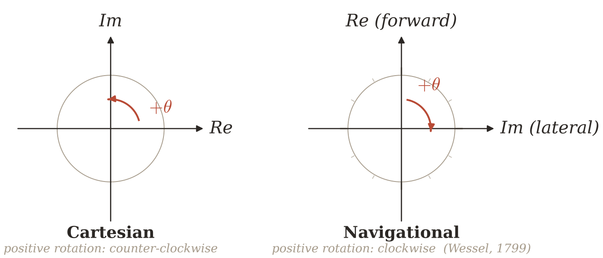

*Reoriente los ejes según Wessel — y $e^{i\theta}$ empieza a girar **en sentido horario**, como una brújula, un timón y el rumbo de un barco.*

<!-- backstage -->

## Párrafo completo (traducción del resumen)

El plano complejo fue dotado por primera vez de forma geométrica por **Caspar Wessel** (1799), y su origen explica mucho: Wessel era un **agrimensor noruego**, y su motivación era la representación analítica de la *dirección*. En el mundo del agrimensor, la orientación natural es **náutica**: adelante es *arriba*, «hacia el lado» es *a la derecha*, y la rotación positiva sigue el movimiento de las manecillas del reloj.

Sin embargo, el diagrama de Argand, que llegó a los libros de texto, eligió la orientación **cartesiana**: el eje real es horizontal, la rotación positiva va **en contra** de las manecillas del reloj.

Restablezca el sistema de Wessel: dirija el eje real **hacia arriba**, el imaginario — **hacia la derecha**. La rotación positiva de $\mathrm{Re}$ a $\mathrm{Im}$, **algebraicamente la misma**, se convierte en rotación **en sentido horario**. La exponencial compleja $e^{i\theta}$ ahora gira junto con las manecillas del reloj, con la brújula que va del norte al este, y con el rumbo del barco que vira a estribor. Las *direct* y *lateral* gaussianas se restablecen como **adelante** y **al costado**.

La **deuda angular**, heredada de los diagramas cartesianos y no de la geometría misma, **se evapora**.

## Por qué esto importa

- En navegación, robótica y control de motores, el «ángulo» es casi siempre **horario desde el norte**. Pero la física matemática, por costumbre, exige la traducción a «antihorario desde el este». Cada traducción de este tipo es una fuente de errores de signo.
- La convención de Wessel hace que $\cos\theta + i\sin\theta$ sea **el mismo** movimiento que $\mathrm{heading}(t)$ de una brújula, sin correcciones.
- El álgebra de $\mathbb{C}$ no cambia: solo cambia el dibujo en la pizarra.

## Referencia

- **Wessel, C. (1799)** *Om directionens analytiske betegning*. Nye samling af det Kongelige Danske Videnskabernes Selskabs Skrifter, 5, 469–518. [sophiararebooks.com](https://www.sophiararebooks.com/pages/books/6397/caspar-wessel/om-directionens-analytiske-betegning-et-forsog-anvendt-fornemmelig-til-plane-og-sphaeriske)
