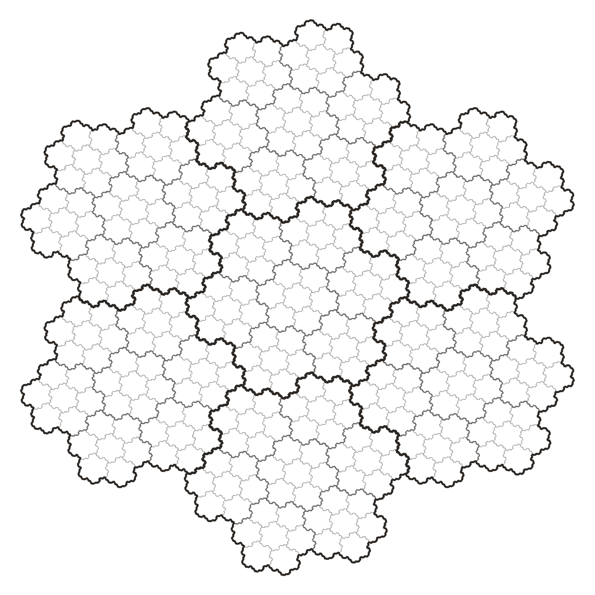

*El atractor del sistema de numeración en base $\beta = 2 - \omega$ es la **isla de Gosper**.*

<!-- backstage -->

## Párrafo completo (traducción del abstract)

¿Cómo se ve el «intervalo unitario» en este sistema de numeración?

En el decimal, todas las cadenas infinitas de dígitos $0.d_1 d_2 \dots$ llenan $[0, 1]$. El atractor análogo en base $(2 - \omega)$ es algo **completamente distinto**: un fractal compuesto por **siete copias autosemejantes** con factor de contracción $1/\sqrt{7}$.

Lo descubrió **Bill Gosper** en 1973; fue **descrito públicamente por primera vez** por **Martin Gardner** en la columna *Mathematical Games* de *Scientific American* (diciembre de 1976), y más tarde **Benoît Mandelbrot** (1977) lo llamó **isla de Gosper** (*Gosper island*).

**Tesela el plano por traslaciones** — **sin huecos, sin superposiciones**, y su **frontera no es suave en ningún punto**. Este es el **dominio fundamental** natural de la aritmética compleja sobre la red hexagonal: la forma que el intervalo unitario siempre quiso tener.

## Por qué no es solo una imagen bonita

- La frontera de la isla de Gosper es la famosa **curva de Gosper**, en honor a la cual se nombró uno de los recorridos canónicos space-filling del plano. En GQ128 este recorrido se usa como **serialización** de valores — la localidad en la curva se corresponde con la cercanía en el plano complejo.
- La dimensión de Hausdorff de la frontera es $\dim_H \partial G = \log 3 / \log \sqrt{7} \approx 1{,}1291$. Es decir, la frontera es una curva, pero «más gruesa» que una ordinaria; este es el origen geométrico del **isotropic quantization error**, que no existe en la red cuadrada.

## Referencias

- **Gardner, M. (1976)** Mathematical games: In which *«monster»* curves force redefinition of the word *«curve»*. *Scientific American*, 235(6), 124–129. [scientificamerican.com](https://www.scientificamerican.com/article/mathematical-games-1976-12/)
- **Mandelbrot, B. B. (1977)** *Fractals: Form, Chance, and Dimension*. San Francisco: W. H. Freeman. [archive.org](https://archive.org/details/fractalsformchan0000mand)
