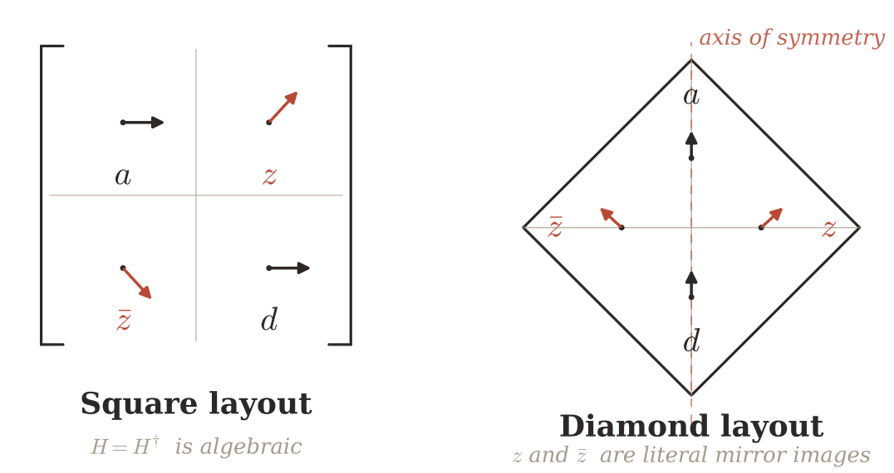

*मैट्रिक्स को कोने पर खड़ा करें, और शर्त $H = H^{\dagger}$ एक शाब्दिक दर्पण-प्रतिबिंब बन जाती है।*

<!-- backstage -->

## पूरा पैराग्राफ (abstract का अनुवाद)

एक सम्मिश्र संख्या का मैट्रिक्स प्रतिनिधित्व अपने भीतर एक दूसरी छिपी सममिति रखता है। मानक लेआउट में $N \times N$ मैट्रिक्स एक **वर्ग** है, जिसका विकर्ण ऊपरी-बाएँ कोने से निचले-दाएँ कोने तक जाता है, और हर्मिटियनता की शर्त $H = H^{\dagger}$ एक **विशुद्ध बीजगणितीय** कथन की तरह दिखती है।

मैट्रिक्स को कोने पर खड़ा करें, जैसे **समचतुर्भुज (rhombus)**, — ताकि विकर्ण **ऊर्ध्वाधर** बन जाए। वास्तविक विकर्ण तत्व ठीक सममिति अक्ष पर आ जाते हैं; तत्व $(i, j)$ और उसका संयुग्म साथी $(j, i)$ इस अक्ष के सापेक्ष **शाब्दिक रूप से दर्पण-सममित** स्थानों पर गिरते हैं। हर्मिटियनता, जो वर्गीय लेआउट में **अदृश्य** थी, **आँख से देखा जा सकने वाला ज्यामितीय प्रतिबिंब** बन जाती है।

:::callout{tone=primary}
एक बच्चे ने कभी पूछा कि दर्पण *बाएँ* और *दाएँ* को क्यों बदल देता है, पर *ऊपर* और *नीचे* को नहीं; उत्तर है — **वह न तो एक करता है न दूसरा**: यह हम ही हैं जो उसकी ओर मुड़ते हुए यह क्रमचय (permutation) थोप देते हैं। मैट्रिक्स का मानक लेआउट बिल्कुल वही मोड़ करता है, एक ऐसी सममिति को छिपाते हुए जो हमेशा वहाँ थी।
:::

## यह हमारे लिए व्याख्यान के कथानक में क्यों ज़रूरी है

- हर्मिटियनता की ज्यामितीय व्याख्या — $\mathbb{Z}[\omega]$ के लिए पूर्व-तैयारी: जब जाली (lattice) वर्ग से षट्कोण में बदलेगी (स्लाइड 5), तो यह «कोने पर खड़ा करने» का तरीका डिफ़ॉल्ट निर्देशांक प्रणाली बन जाएगा।
- साथ ही — GQ128 में **त्रुटि परिमाणीकरण (error quantization) की समदैशिकता (isotropy)** की तैयारी: वहाँ भी IEEE 754 का मानक «वर्ग» असली सममिति को देखने में बाधा डालता है।
