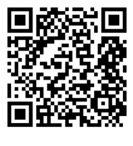

*यह शोध कार्य किया जा रहा है* **Prof. Dr.Math. Jekaterina Gromova** *और* **Prof. Dr.Phys. Dmitry Bocharov** *के वैज्ञानिक मार्गदर्शन में।*

<!-- backstage -->

## सारांश के संदर्भ

**Eisenstein, G. (1844)**
Beweis des Reciprocitätssatzes für die cubischen Reste in der Theorie der aus dritten Wurzeln der Einheit zusammengesetzten complexen Zahlen.
*Journal für die reine und angewandte Mathematik*, 27, 289–310.
[degruyterbrill.com/…/crll.1844.27.289](https://www.degruyterbrill.com/document/doi/10.1515/crll.1844.27.289/html)

**Euler, L. (1748)**
*Introductio in analysin infinitorum*. Lausanne: Marcum-Michaelem Bousquet.
[scholarlycommons.pacific.edu/euler-works/101](https://scholarlycommons.pacific.edu/euler-works/101/)

**Gardner, M. (1976)**
Mathematical games: In which *«monster»* curves force redefinition of the word *«curve»*.
*Scientific American*, 235(6), 124–129.
[scientificamerican.com/…/mathematical-games-1976-12](https://www.scientificamerican.com/article/mathematical-games-1976-12/)

**Gauss, C. F. (1831)**
Theoria residuorum biquadraticorum, Commentatio secunda.
*Göttingische gelehrte Anzeigen*, 64, 169–178.
[sophiararebooks.com/…/theoria-residuorum-biquadraticorum](https://www.sophiararebooks.com/pages/books/6172/carl-friedrich-gauss/theoria-residuorum-biquadraticorum-commentatio-prima-secunda)

**Ireland, K. and Rosen, M. (1990)**
*A Classical Introduction to Modern Number Theory*, 2nd ed. New York: Springer-Verlag.
[link.springer.com/book/10.1007/978-1-4757-2103-4](https://link.springer.com/book/10.1007/978-1-4757-2103-4)

**Knuth, D. E. (1960)**
An imaginary number system.
*Communications of the ACM*, 3(4), 245–247. DOI:10.1145/367177.367233.
[dl.acm.org/doi/10.1145/367177.367233](https://dl.acm.org/doi/10.1145/367177.367233)

**Mandelbrot, B. B. (1977)**
*Fractals: Form, Chance, and Dimension*. San Francisco: W. H. Freeman.
[archive.org/details/fractalsformchan0000mand](https://archive.org/details/fractalsformchan0000mand)

**Wessel, C. (1799)**
Om directionens analytiske betegning. *Nye samling af det Kongelige Danske Videnskabernes Selskabs Skrifter*, 5, 469–518.
[sophiararebooks.com/…/om-directionens-analytiske-betegning](https://www.sophiararebooks.com/pages/books/6397/caspar-wessel/om-directionens-analytiske-betegning-et-forsog-anvendt-fornemmelig-til-plane-og-sphaeriske)

## सहवर्ती प्रस्तुतियों के लिए आभार

**RaTSiF-2026 Spring** (49वाँ सत्र, TSI, रीगा, 24 अप्रैल 2026) की आयोजन समिति को धन्यवाद — और, व्यापक अर्थ में, उन सभी को जो मंच पर और श्रोताओं के बीच इस बात को स्वीकार करने के लिए तैयार हैं कि «सौंदर्य» और «तकनीकी ऋण» — **एक ही** विषय हैं, जिन्हें विभिन्न कोणों से देखा जा रहा है।
